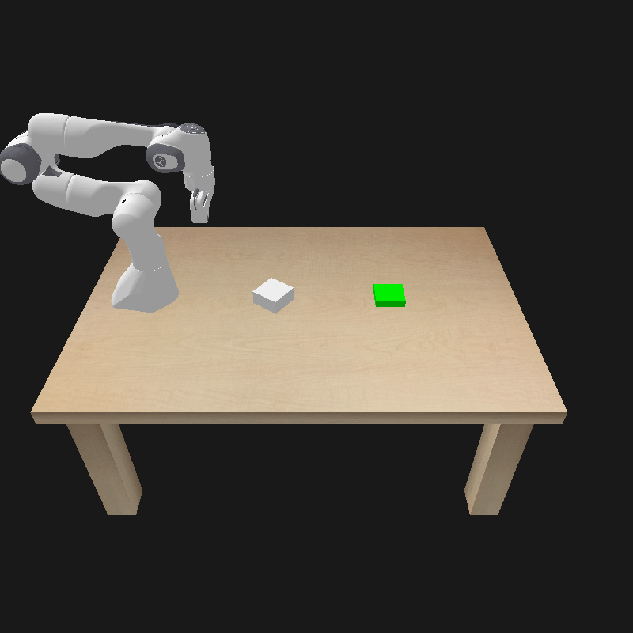
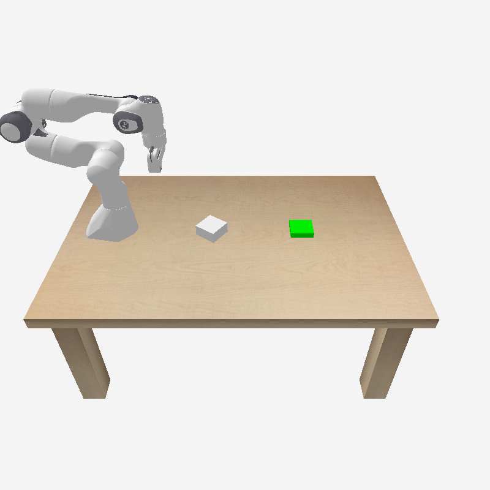
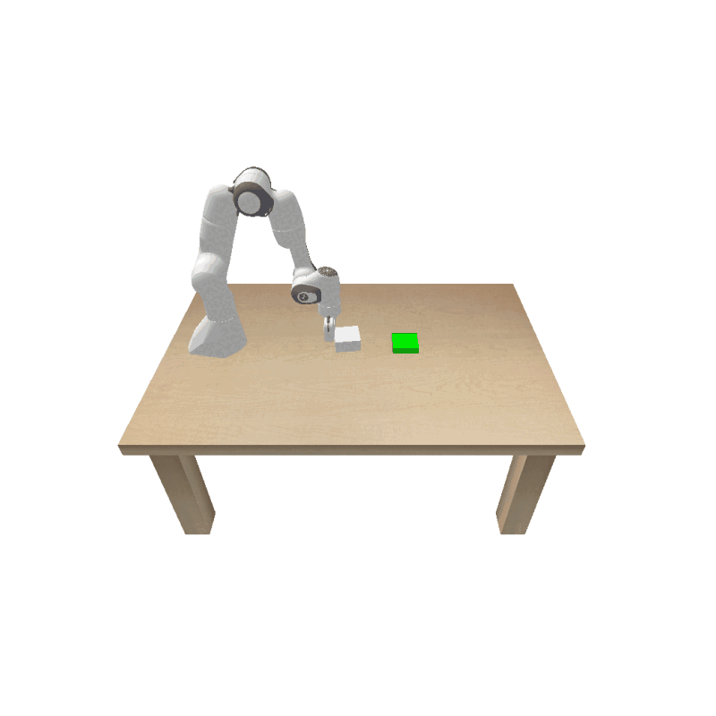
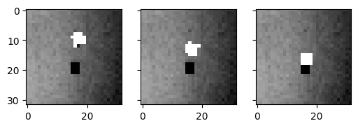
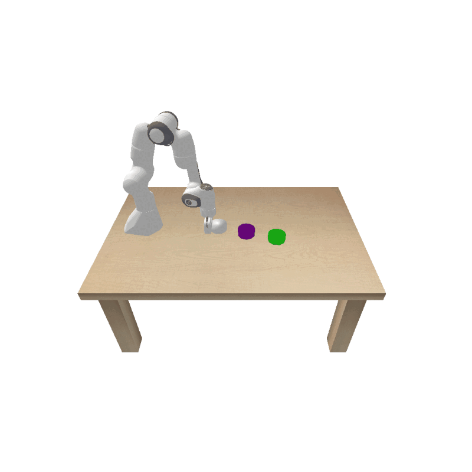

# Robot Learning

- **Learning-Based Robot Planning with PPO and Diffusion Policy**

Implemented and compared Proximal Policy Optimization (PPO) and Diffusion Policy for robot motion planning and control, focusing on continuous action spaces in manipulation tasks.
<table>
  <tr>
    <td align="center">
      <b>PPO</b> 
      
    </td>
    <td align="center">
      <b>Diffusion Policy</b> 
      
    </td>
  </tr>
</table>

- **Vision-Based Robot Control in Latent Space:**

Encoded state images into a latent space using a Variational Autoencoder (VAE), then applied Model Predictive Path Integral (MPPI) control in the latent space to drive the robot arm toward the desired state.

<!-- 
 -->
<table>
  <tr>
    <td align="center">
      <b>VAE</b> 
      
    </td>
    <td align="center">
      <b>state image</b> 
      
    </td>
  </tr>
</table>

- **Gaussian Process Based Robot pushing with Obstacle Avoidance**
Implemented Gaussian Process to model uncertain dynamics and applied Model Predictive Path Integral (MPPI) control for obstacle-aware object pushing.

