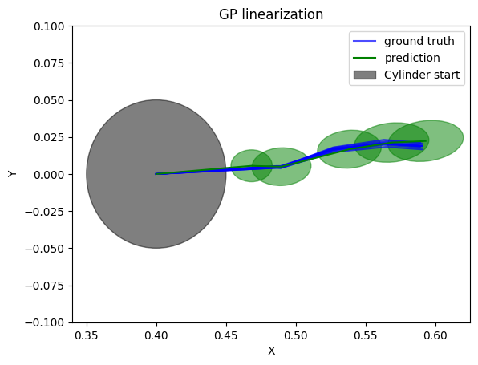

# Robot Learning

<!-- - **Learning-Based Robot Planning with PPO and Diffusion Policy**

Implemented and compared Proximal Policy Optimization (PPO) and Diffusion Policy for robot motion planning and control, focusing on continuous action spaces in manipulation tasks.
<table>
  <tr>
    <td align="center">
      <b>PPO</b> 
      
    </td>
    <td align="center">
      <b>Diffusion Policy</b> 
      
    </td>
  </tr>
</table> -->

<table>
  <tr>
    <td colspan="2" align="center">
      <h2>Learning-Based Robot Planning with PPO and Diffusion Policy</h2>
      

        Implemented and compared <b>Proximal Policy Optimization (PPO)</b> and <b>Diffusion Policy</b>
        for robot motion planning and control, focusing on continuous action spaces in manipulation tasks.
      

    </td>
  </tr>
  <tr>
    <td align="center">
      <b>PPO</b> 
      
    </td>
    <td align="center">
      <b>Diffusion Policy</b> 
      
    </td>
  </tr>
</table>

<table>
  <tr>
    <td colspan="2" align="center">
      <h2>Vision-Based Robot Control in Latent Space</h2>
      

        Encoded state images into a latent space using a <b>Variational Autoencoder (VAE)</b>, then applied
        <b>Model Predictive Path Integral (MPPI)</b> control in the latent space to drive the robot arm toward the desired state.
      

    </td>
  </tr>
  <tr>
    <td align="center">
      <b>VAE Latent Control Demo</b> 
      
    </td>
    <td align="center">
      <b>State Image Input</b> 
      
    </td>
  </tr>
</table>

<table>
  <tr>
    <td colspan="2" align="center">
      <h2>Gaussian Process Based Robot Pushing with Obstacle Avoidance</h2>
      

        Implemented <b>Gaussian Process (GP)</b> models to capture uncertain system dynamics, and applied
        <b>Model Predictive Path Integral (MPPI)</b> control to enable obstacle-aware object pushing under uncertainty.
      

    </td>
  </tr>
  <tr>
    <td align="center">
      <b>GP-Based Pushing Demo</b> 
      
    </td>
    <td align="center">
      <b>Prediction with GP</b> 
      
    </td>
  </tr>
</table>

